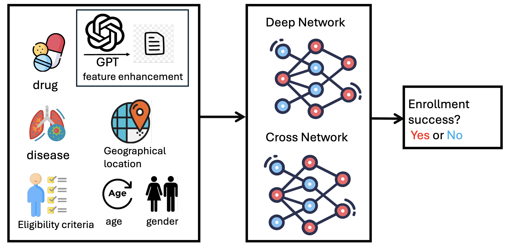

# TrialEnroll: Predicting Clinical Trial Enrollment Success with Deep & Cross Network and Large Language Models

[](https://arxiv.org/abs/2407.13115)

## Overview


This repository contains the code for the paper "TrialEnroll: Predicting Clinical Trial Enrollment Success with Deep & Cross Network and Large Language Models." The project leverages advanced machine learning techniques to predict the success of clinical trial enrollments.

## Requirements
- Python 3.10
- PyTorch 2.3

## Data Sources
- [ClinicalTrials.gov](https://clinicaltrials.gov)
- [IQVIA Label Data](https://github.com/futianfan/clinical-trial-outcome-prediction/tree/main/IQVIA)

## Getting Started

### 1. Download the ClinicalTrial Data
```bash
cd data
wget https://clinicaltrials.gov/AllPublicXML.zip
```

### 2. Decompress the Data File
```bash
unzip AllPublicXML.zip -d trials
find trials/* -name "NCT*.xml" | sort > trials/all_xml.txt
```

### 3. Download IQVIA Label Data
Download the IQVIA label data from [here](https://github.com/futianfan/clinical-trial-outcome-prediction/tree/main/IQVIA) and place it in the `data/` directory. Rename the file `trial_outcomes_v1.csv` to `IQVIA_trial_outcomes.csv`.

## Data Preprocessing

### 1. Preprocess Clinical Trial Data
Navigate to the preprocessing directory and run the following scripts:
```bash
cd TrialEnroll/preprocess
python collect_age.py
python collect_location.py
python collect_str.py
python collect_time.py
python save_df.py
```

### 2. Preprocess LLM Generated Features
Download the Mistral-7B-Instruct model:
```bash
huggingface-cli download --resume-download mistralai/Mistral-7B-Instruct-v0.3 --local-dir 7B-Instruct-v0.3
```
Set the Mistral path in `llm_request_MistralInstruct.py`. Then, create the necessary directories and run the preprocessing scripts:
```bash
cd TrialEnroll/llm_emb
mkdir -p data_llm/disease/MistralInstruct data_llm/drug/MistralInstruct
python preprocess.py
python llm_request_MistralInstruct.py
python embedding.py
```

### 3. Prepare Criteria Embedding
```bash
cd TrialEnroll
python protocol_encode.py
```

## Model Training

### 1. Run DCN Preprocessing
```bash
python col_preprocessing.py
python stack_features_dcn.py
python hatten_cross.py
```

## Results
The model achieved a PR AUC of 0.7015.

## Citation
If you use this code, please cite our paper:
```
@article{yue2024trialenroll,
  title={Trialenroll: Predicting clinical trial enrollment success with deep \& cross network and large language models},
  author={Yue, Ling and Xing, Sixue and Chen, Jintai and Fu, Tianfan},
  journal={arXiv preprint arXiv:2407.13115},
  year={2024}
}
```

## Contact
For any questions or issues, please contact [yuel2@rpi.edu].
